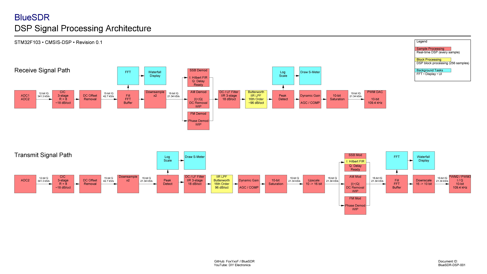
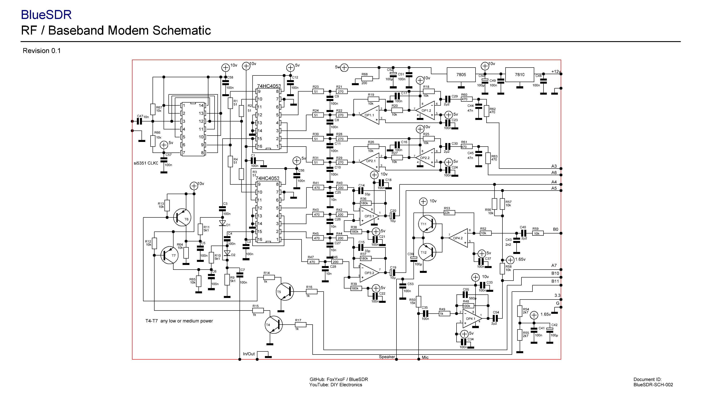
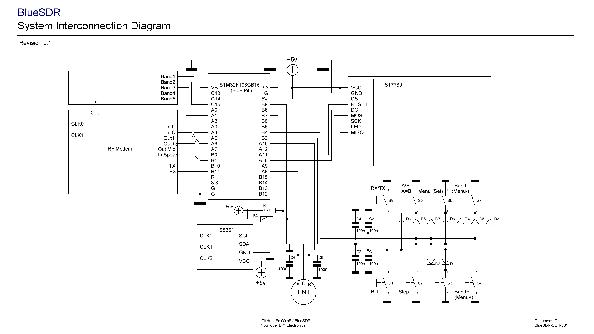

# BlueSDR

**STM32F103C8T6 Software Defined Radio (SDR) Transceiver — v0.1 prototype**

Hybrid SDR system with real-time DSP processing, analog RF frontend, and TFT spectrum display.

---

## 📡 Overview

BlueSDR is an experimental software-defined radio transceiver based on STM32F103 (Blue Pill).

The system combines real-time digital signal processing with an analog RF/baseband frontend, PWM-based DAC output, and a TFT spectrum display.

The project is currently a working prototype.

---

## 🧠 System Architecture

The system is built around a hybrid DSP pipeline:

- ADC input (baseband / I-Q signals)
- Digital filtering (IIR / FIR stages)
- Hilbert transform (phase shifting)
- AGC / dynamic gain control
- FFT spectrum analysis
- PWM DAC output stage (10-bit effective resolution)

---

## 📻 RF Frontend

Analog subsystem includes:

- RF mixing stage
- Op-amp based filtering
- Baseband conditioning
- TX/RX switching
- Audio interface (microphone / speaker path)

---

## 🖥️ System Integration

Main system components:

- STM32F103 microcontroller
- SI5351 clock generator
- TFT display (ILI9341)
- Encoder and button interface

---

## 📷 Hardware Prototype

---

## ⚙️ Firmware

Precompiled firmware is available:

Firmware/BlueSDR_v0.1_04072026.hex

### Flashing

Use one of the following tools:

- STM32CubeProgrammer
- ST-Link Utility
- OpenOCD

Target MCU:
STM32F103C8T6 (Blue Pill)

---

## 📊 Features

### Receiver
- Real-time FFT spectrum display
- Waterfall visualization
- S-meter (signal level)
- AGC / dynamic gain control
- Digital filtering chain

### Transmitter
- Baseband processing
- Gain control and compression
- PWM DAC output

### User Interface
- TFT SPI display
- Rotary encoder tuning
- Band selection
- Basic control menu

---

## 📌 Notes

- Experimental SDR platform
- Real-time fixed-point DSP (Q15/Q31)
- Hybrid analog + digital architecture
- Prototype stage (v0.1)

---

## 🔗 Links

GitHub: https://github.com/FoxYxoF/BlueSDR  
YouTube: https://www.youtube.com/@diyelectronics2595  

---

## 📜 License

Experimental / non-commercial prototype