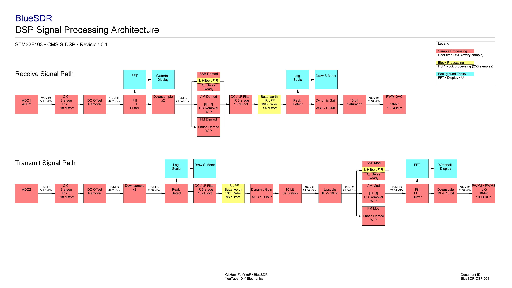
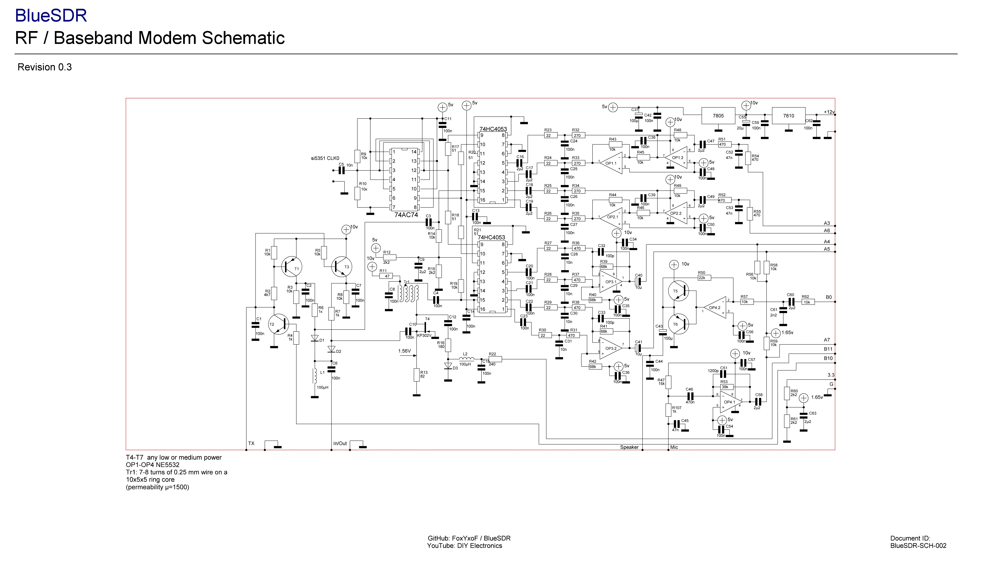
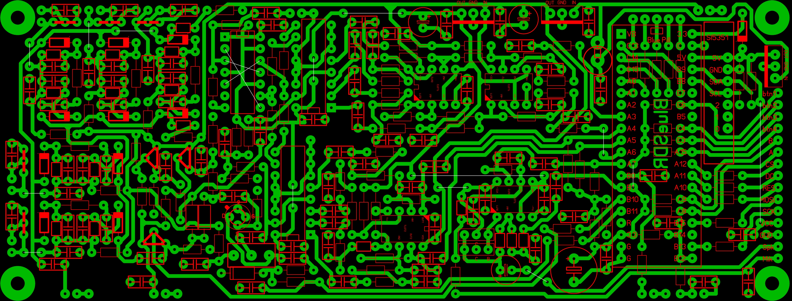
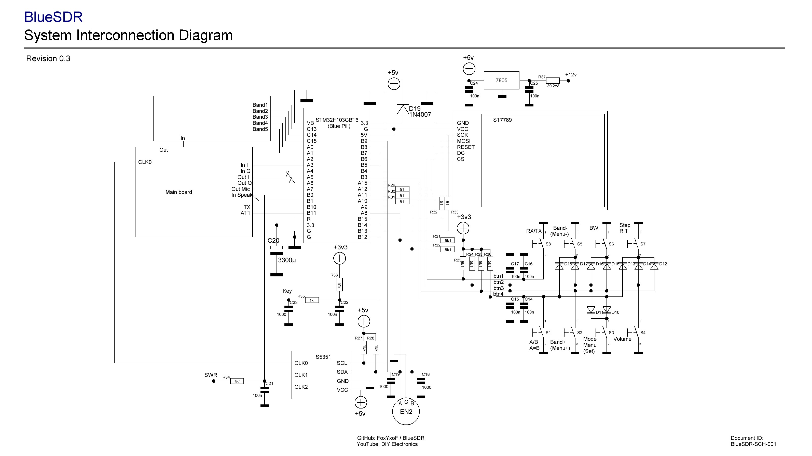
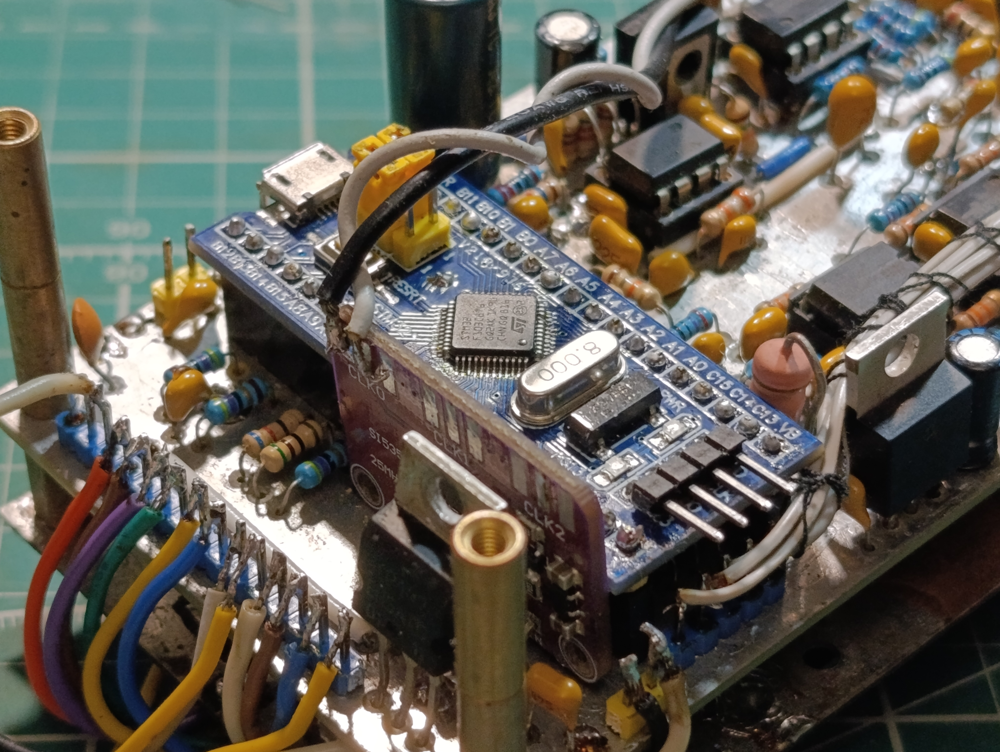
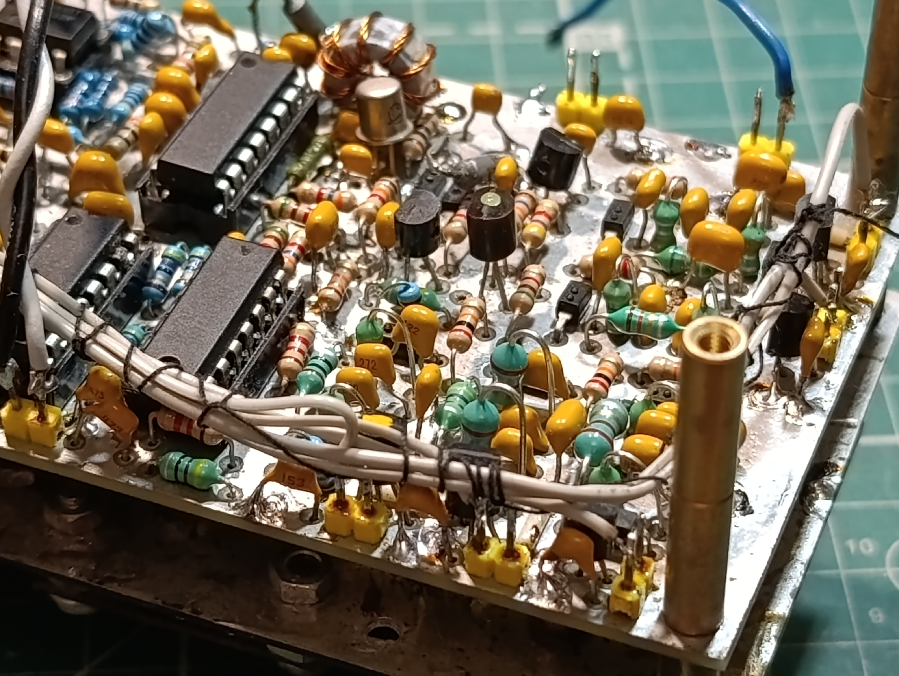

# BlueSDR

**Программно-определяемый трансивер (SDR) на базе STM32F103C8T6 — v0.2**

Гибридная SDR-система DSP обработкой в реальном времени, аналоговым ВЧ-трактом (RF frontend) и TFT-дисплеем спектра.

---

## 📡 Общее описание

BlueSDR — это экспериментальный SDR радиотрансивер, построенный на микроконтроллере STM32F103 (Blue Pill) и генераторе тактовых частот SI5351.

Система сочетает в себе цифровую обработку сигналов в реальном времени с аналоговым ВЧ/НЧ-трактом, ШИМ-выходом ЦАП и графическим TFT-индикатором спектра.

---

## 🧠 Архитектура системы

В основе системы лежит гибридный конвейер ЦОС (DSP):

- Вход АЦП (сигналы базовой полосы / I-Q компоненты)
- Цифровая фильтрация (каскады БИХ / КИХ фильтров)
- Преобразование Гильберта (фазовый сдвиг)
- АРУ / динамическое управление усилением
- БПФ (FFT) анализ спектра
- Выходной каскад ШИМ ЦАП (эффективное разрешение 10 бит)

---

## 📻 ВЧ-тракт (RF Frontend)

[`Печатная плата в формате .lay6(Sprin-Layout)`](images/Main_board.lay6)

Аналоговая подсистема включает в себя:

- Каскад ВЧ-смесителя
- Фильтрацию на операционных усилителях
- Формирование сигналов базовой полосы (baseband)
- Переключение прием/передача (TX/RX)
- Аудиоинтерфейс (тракт микрофона / динамика)

---

## 🖥️ Системная интеграция

Основные компоненты системы:

- Микроконтроллер STM32F103  
- Генератор тактовых частот SI5351  
- Аналоговый ВЧ/НЧ-тракт (RF/baseband)  
- TFT-дисплей спектра  
- Интерфейс энкодера и кнопок  

---

## 📷 Прототип устройства

---

## ⚙️ Прошивка

Скомпилированные бинарные файлы прошивок:

| Версия | Дата релиза | Ссылка на скачивание | Статус |
| :--- | :--- | :--- | :--- |
| **v0.3** | 17.09.2026 | [`BlueSDR_v0.3_16092026.hex`](Firmware/BlueSDR_v0.2_28072026.hex) | **Актуальная** |
| **v0.2** | 28.07.2026 | [`BlueSDR_v0.2_28072026.hex`](Firmware/BlueSDR_v0.2_28072026.hex) | Устаревший прототип |
| **v0.1** | 04.07.2026 | [`BlueSDR_v0.1_04072026.hex`](Firmware/BlueSDR_v0.1_04072026.hex) | Устаревший прототип |

### Прошивка микроконтроллера

Используйте любой из следующих инструментов:

- STM32CubeProgrammer
- ST-Link Utility
- OpenOCD

Целевой МК:
STM32F103C8T6 (Blue Pill)

---

## 📊 Возможности и список изменений (v0.2)

### Приемник и DSP
- **Калибровка SI5351:** Добавлена точная калибровка тактового генератора.
- **Настройка I-Q каналов:** Регулировка фазы и баланса для подавления зеркального канала.
- **Продвинутая АРУ:** Динамическое управление усилением с настраиваемыми параметрами атаки (Attack), восстановления (Release) и порога (Threshold).
- **Режимы модуляции:** Быстрое переключение режимов, включая вновь добавленную **AM-модуляцию**.
- **Управление полосой пропускания:** Независимая регулировка полосы пропускания для каждого типа модуляции.
- **Визуализация:** БПФ-спектр (FFT) и «водопад» в реальном времени с отображением активной полосы пропускания.
- **Аудио:** Плавная регулировка громкости.

### Передатчик
- Обработка сигналов базовой полосы.
- Компрессор микрофона с полным динамическим контролем (Атака, Восстановление, Порог).
- Выход ШИМ ЦАП.

### Пользовательский интерфейс и система
- TFT SPI дисплей с поддержкой «водопада».
- Настройка частоты и выбор шага с помощью поворотного энкодера.
- **Сохранение состояния:** Хранение параметров трансивера в энергонезависимой памяти (полоса пропускания, модуляция, диапазон, VFO, громкость и шаг перестройки).

---

## 📌 Примечания

- Экспериментальная SDR-платформа
- ЦОС реального времени с фиксированной точкой (Q15/Q31)
- Гибридная аналогово-цифровая архитектура
- Текущая версия: v0.2 стабильный прототип

---

## 🔗 Ссылки

GitHub: https://github.com/FoxYxoF/BlueSDR  
YouTube: https://www.youtube.com/@diyelectronics2595  

---

## 📜 Лицензия

Экспериментальный / некоммерческий прототип