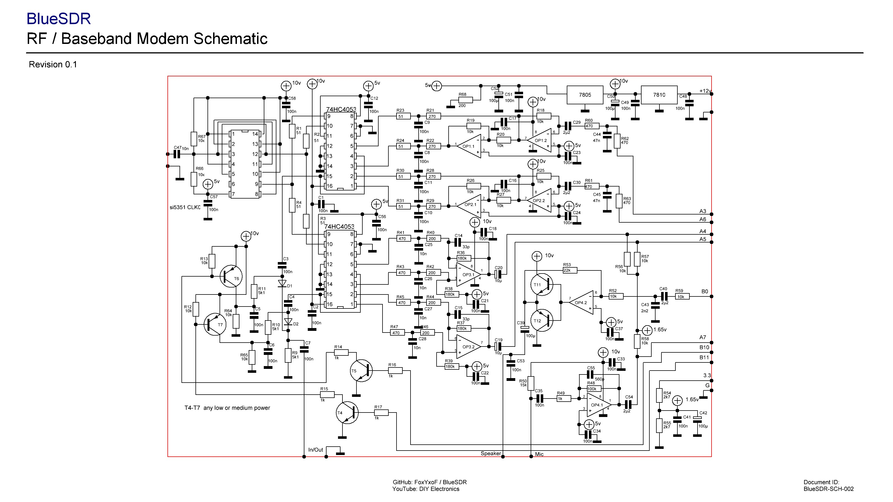
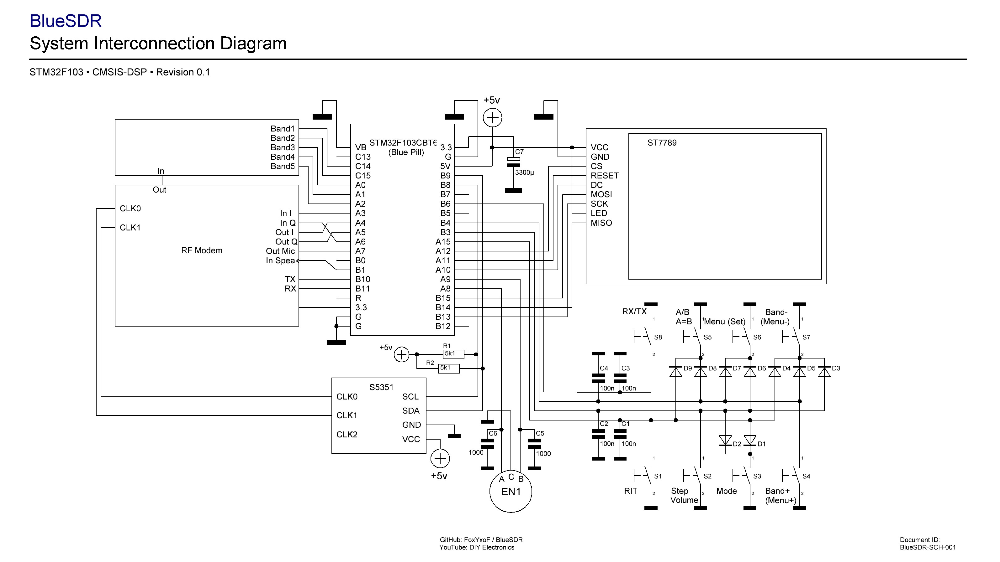
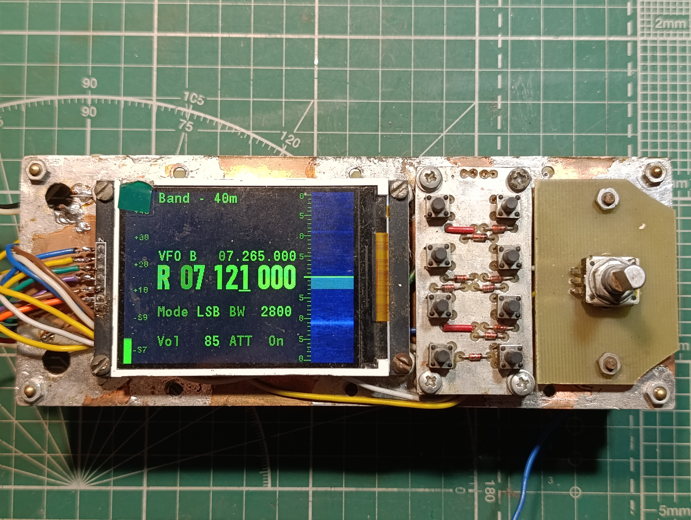
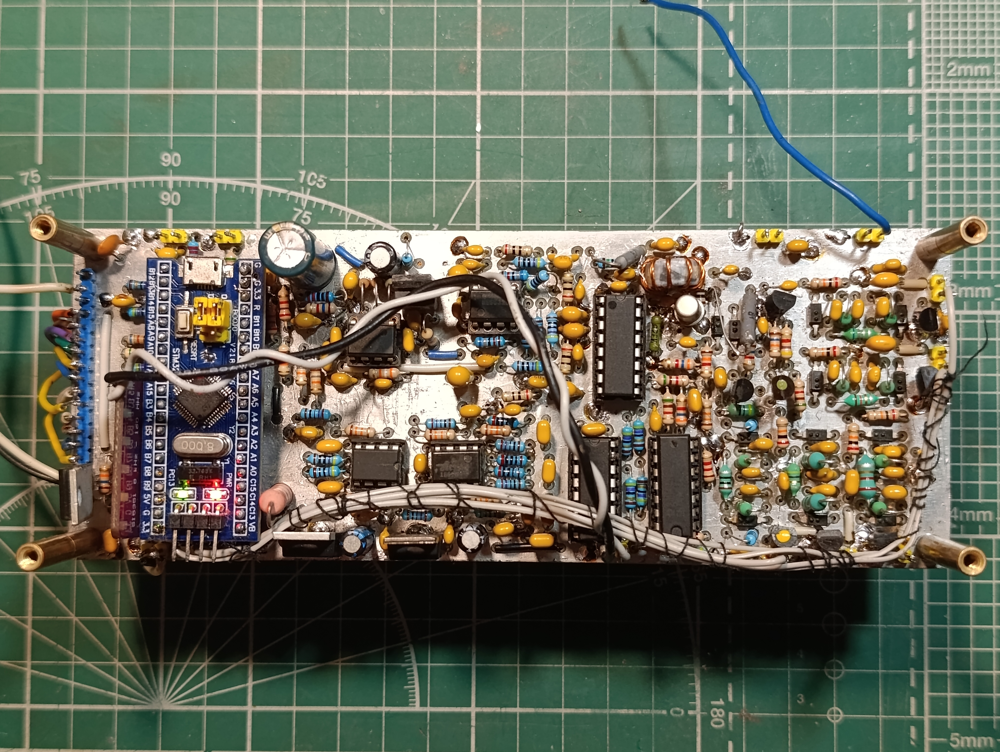

# BlueSDR

**STM32F103C8T6 Software Defined Radio (SDR) Transceiver — v0.2**

Hybrid SDR system with real-time DSP processing, analog RF frontend, and TFT spectrum display.

---

## 📡 Overview

BlueSDR is an experimental software-defined radio transceiver based on STM32F103 (Blue Pill) and SI5351 clock generator.

The system combines real-time digital signal processing with an analog RF/baseband frontend, PWM-based DAC output, and a TFT spectrum display.

---

## 🧠 System Architecture

The system is built around a hybrid DSP pipeline:

- ADC input (baseband / I-Q signals)
- Digital filtering (IIR / FIR stages)
- Hilbert transform (phase shifting)
- AGC / dynamic gain control
- FFT spectrum analysis
- PWM DAC output stage (10-bit effective resolution)

---

## 📻 RF Frontend

Analog subsystem includes:

- RF mixing stage
- Op-amp based filtering
- Baseband conditioning
- TX/RX switching
- Audio interface (microphone / speaker path)

---

## 🖥️ System Integration

Main system components:

- STM32F103 microcontroller  
- SI5351 clock generator  
- Analog RF/baseband frontend  
- TFT spectrum display  
- Encoder and button interface  

---

## 📷 Hardware Prototype

---

## ⚙️ Firmware

Precompiled firmware binaries:

| Version | Release Date | File Path | Status |
| :--- | :--- | :--- | :--- |
| **v0.2** | 28.07.2026 | `Firmware/BlueSDR_v0.2_28072026.hex` | **Latest (Stable)** |
| **v0.1** | 04.07.2026 | `Firmware/BlueSDR_v0.1_04072026.hex` | Outdated Prototype |

### Flashing

Use one of the following tools:

- STM32CubeProgrammer
- ST-Link Utility
- OpenOCD

Target MCU:
STM32F103C8T6 (Blue Pill)

---

## 📊 Features & Changelog (v0.2)

### Receiver & DSP
- **SI5351 Calibration:** Added precise clock generator calibration.
- **I-Q Channel Tuning:** Phase and balance adjustment for mirror channel rejection.
- **Advanced AGC:** Dynamic gain control with adjustable Attack, Release, and Threshold.
- **Modulation Modes:** Quick switching between modes, including newly added **AM modulation**.
- **Bandwidth Control:** Independent bandwidth adjustment for each modulation type.
- **Visuals:** Real-time FFT spectrum and waterfall display with active bandwidth visualization.
- **Audio:** Smooth volume regulation.

### Transmitter
- Baseband processing.
- Microphone compressor with full dynamic control (Attack, Release, Threshold).
- PWM DAC output.

### User Interface & System
- TFT SPI display with waterfall.
- Rotary encoder tuning and step selection.
- **State Saving:** Non-volatile memory storage for transceiver state (Bandwidth, Modulation, Band, VFO, Volume, and Tuning Step).

---

## 📌 Notes

- Experimental SDR platform
- Real-time fixed-point DSP (Q15/Q31)
- Hybrid analog + digital architecture
- Current version: v0.2 stable prototype

---

## 🔗 Links

GitHub: https://github.com/FoxYxoF/BlueSDR  
YouTube: https://www.youtube.com/@diyelectronics2595  

---

## 📜 License

Experimental / non-commercial prototype